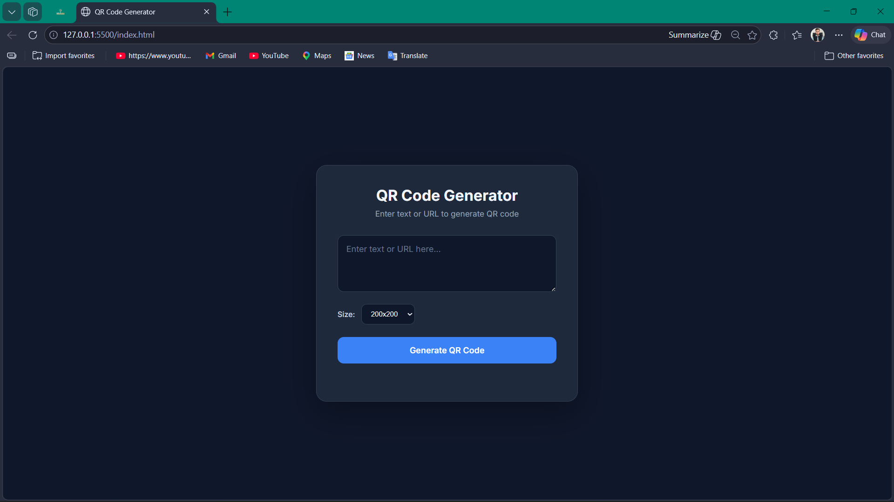
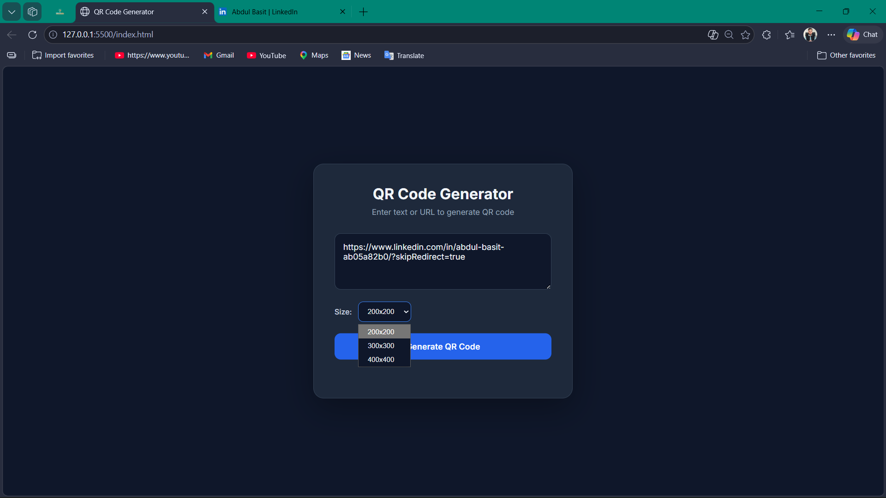
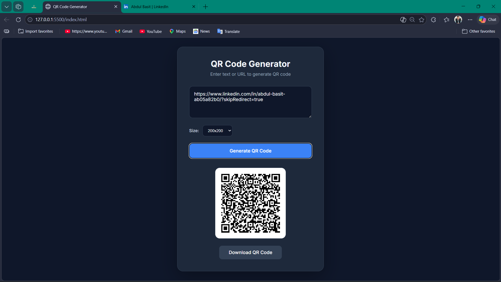
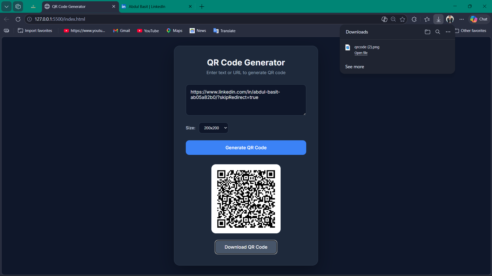

# QR Code Generator 🚀

A professional and lightweight QR Code Generator built with clean, modern web technologies. This tool allows users to quickly generate QR codes for any text or URL with customizable sizes and an easy download feature.

## ✨ Features

- **Instant Generation:** Enter your text or URL and generate a QR code in seconds.
- **Customizable Sizes:** Choose from multiple sizes (200x200, 300x300, 400x400) to fit your needs.
- **Easy Download:** Save your generated QR codes as high-quality PNG images with one click.
- **Modern UI:** A beautiful, responsive interface with a dark theme and "Inter" typography.
- **Premium Design:** Using glassmorphism effects and smooth transitions for an enhanced user experience.

## 🛠️ Tech Stack

- **HTML5:** For the structural foundation.
- **CSS3:** For the stylish dark theme and responsive layout.
- **Vanilla JavaScript:** To handle the generation logic and user interactions.
- **QRCode.js:** A popular library used for generating the QR code graphics.

## 📸 Screenshots

Here is a visual overview of the application:

<div align="center">
  <h3>Main Interface</h3>
  
  <br><br>
  
  <h3>Size Selection</h3>
  
  <br><br>
  
  <h3>Generated Code View</h3>
  
  <br><br>
  
  <h3>Mobile Responsive Design</h3>
  
</div>

## 🚀 How to Run Locally

1. Clone this repository to your local machine:
   ```bash
   git clone https://github.com/AbdulBasiTcs1/QR-CODE-GENERATOR.git
   ```
2. Open the `index.html` file in your favorite web browser.
3. Start generating your QR codes!

---

**Made with ❤️ by Abdul Basit**
